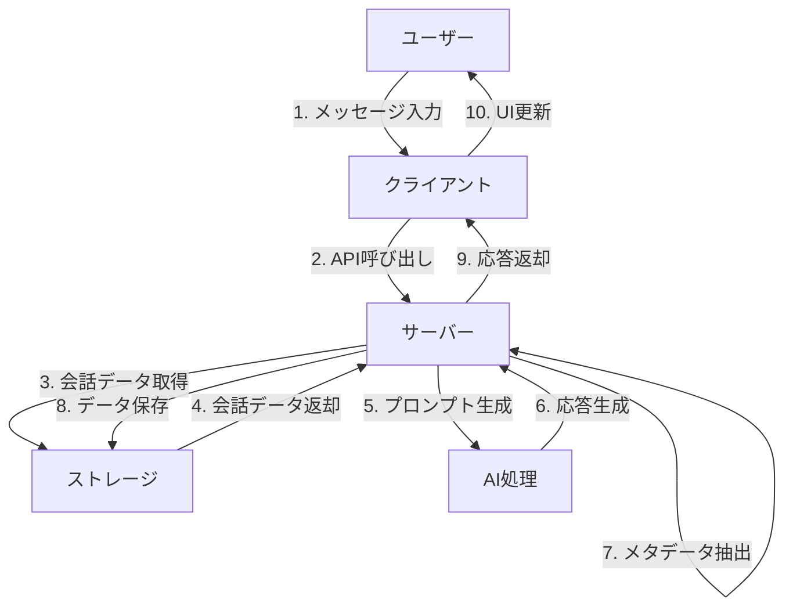
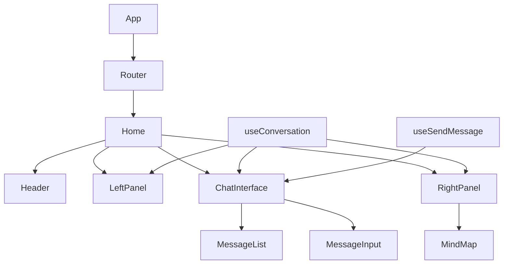

# プロジェクトディレクトリ構造

このドキュメントでは、ConstructiveTalkアプリケーションのディレクトリ構造と各ディレクトリの役割について説明します。

## 全体構造

```
constructive-talk/
├── client/                  # フロントエンド（画面表示）部分
│   ├── src/                 # ソースコード
│   │   ├── components/      # 再利用可能なUIコンポーネント
│   │   │   ├── chat/        # チャット関連のコンポーネント
│   │   │   ├── layout/      # レイアウト関連のコンポーネント
│   │   │   ├── mindmap/     # マインドマップ関連のコンポーネント
│   │   │   └── ui/          # 基本的なUIコンポーネント
│   │   ├── hooks/           # カスタムReactフック
│   │   ├── lib/             # ユーティリティ関数やライブラリ
│   │   ├── pages/           # ページコンポーネント
│   │   ├── types/           # TypeScript型定義
│   │   ├── App.tsx          # アプリケーションのメインコンポーネント
│   │   ├── index.css        # グローバルスタイル
│   │   └── main.tsx         # アプリケーションのエントリーポイント
│   └── index.html           # HTMLテンプレート
├── server/                  # バックエンド（サーバー側）部分
│   ├── ai/                  # AI関連の処理
│   │   └── gemini.ts        # Google Gemini AIとの連携
│   ├── line/                # LINE連携機能
│   │   ├── client.ts        # LINEクライアント設定
│   │   └── handlers.ts      # LINEウェブフックハンドラー
│   ├── index.ts             # サーバーのエントリーポイント
│   ├── routes.ts            # APIルート定義
│   ├── storage.ts           # データ保存関連の処理
│   ├── prd-content.ts       # システムプロンプト生成
│   └── vite.ts              # 開発環境設定
├── shared/                  # クライアントとサーバーで共有するコード
│   └── schema.ts            # データスキーマと型定義
├── attached_assets/         # 添付アセット
│   └── PRD.md               # 製品要件定義書
├── drizzle.config.ts        # Drizzle ORM設定
├── package.json             # プロジェクト依存関係と設定
├── postcss.config.js        # PostCSS設定
├── tailwind.config.ts       # Tailwind CSS設定
├── tsconfig.json            # TypeScript設定
├── vite.config.ts           # Vite設定
└── README.md                # プロジェクト説明
```

## 主要ディレクトリの説明

### client
フロントエンド（ユーザーインターフェース）部分が含まれています。React、TypeScript、Tailwind CSSを使用して構築されています。詳細は[client/README.md](client/README.md)を参照してください。

### server
バックエンド（サーバー側）部分が含まれています。Express.js、Google Gemini AI、LINE Messaging APIを使用して構築されています。詳細は[server/README.md](server/README.md)を参照してください。

### shared
クライアントとサーバーの両方で共有されるコードが含まれています。主にデータ構造の型定義を管理しています。詳細は[shared/README.md](shared/README.md)を参照してください。

## アプリケーションのデータフロー



## コンポーネント間の関係



## APIエンドポイント

| エンドポイント | メソッド | 説明 |
|--------------|---------|------|
| `/api/conversations` | GET | すべての会話リストを取得 |
| `/api/conversations/:id` | GET | 特定のIDの会話を取得 |
| `/api/conversations` | POST | 新しい会話を作成 |
| `/api/conversations/:id/messages` | POST | 会話にメッセージを追加 |
| `/api/conversations/:id/context` | PATCH | 会話のコンテキスト情報を更新 |
| `/api/conversations/:id/export` | GET | 会話をMarkdown形式でエクスポート |
| `/api/webhook` | POST | LINEボットのウェブフックエンドポイント |

## 各ディレクトリのREADME

各ディレクトリには、そのディレクトリの詳細な説明を含むREADMEファイルがあります：

- [client/README.md](client/README.md) - クライアント（フロントエンド）の説明
- [client/src/components/README.md](client/src/components/README.md) - UIコンポーネントの説明
- [client/src/hooks/README.md](client/src/hooks/README.md) - カスタムフックの説明
- [client/src/pages/README.md](client/src/pages/README.md) - ページコンポーネントの説明
- [server/README.md](server/README.md) - サーバー（バックエンド）の説明
- [server/ai/README.md](server/ai/README.md) - AI処理の説明
- [server/line/README.md](server/line/README.md) - LINE連携の説明
- [shared/README.md](shared/README.md) - 共有コードの説明 