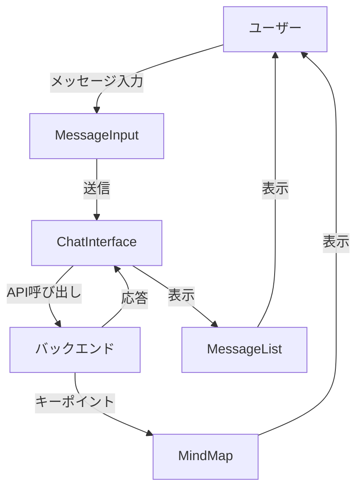

# クライアント（フロントエンド）

## 概要
このディレクトリには、ConstructiveTalkアプリケーションのフロントエンド（ユーザーインターフェース）部分が含まれています。React、TypeScript、Tailwind CSSを使用して構築されており、ユーザーがAIと対話するためのインターフェースを提供します。

## ディレクトリ構造
```
client/
├── src/                      # ソースコード
│   ├── components/           # 再利用可能なUIコンポーネント
│   │   ├── chat/             # チャット関連のコンポーネント
│   │   ├── layout/           # レイアウト関連のコンポーネント
│   │   ├── mindmap/          # マインドマップ関連のコンポーネント
│   │   └── ui/               # 基本的なUIコンポーネント
│   ├── hooks/                # カスタムReactフック
│   ├── lib/                  # ユーティリティ関数やライブラリ
│   ├── pages/                # ページコンポーネント
│   ├── types/                # TypeScript型定義
│   ├── App.tsx               # アプリケーションのメインコンポーネント
│   ├── index.css             # グローバルスタイル
│   └── main.tsx              # アプリケーションのエントリーポイント
└── index.html                # HTMLテンプレート
```

## 主要コンポーネント

### ページ
- `pages/home.tsx`: アプリケーションのメインページ。チャットインターフェース、サイドパネル、コンテキスト情報を表示します。
- `pages/not-found.tsx`: 404ページ。存在しないURLにアクセスした場合に表示されます。

### レイアウト
- `components/layout/Header.tsx`: アプリケーションのヘッダー部分。タイトルと新規会話ボタンを含みます。
- `components/layout/LeftPanel.tsx`: 左側のパネル。会話の一覧を表示します。
- `components/layout/RightPanel.tsx`: 右側のパネル。会話のコンテキスト情報とマインドマップを表示します。

### チャット
- `components/chat/ChatInterface.tsx`: チャットインターフェース全体を管理するコンポーネント。
- `components/chat/MessageList.tsx`: チャットメッセージの一覧を表示するコンポーネント。
- `components/chat/MessageInput.tsx`: メッセージ入力フォームを提供するコンポーネント。

### マインドマップ
- `components/mindmap/MindMap.tsx`: 会話から抽出されたキーポイントを視覚的に表示するコンポーネント。

## データフロー



## 使用方法
フロントエンドの開発を行う場合は、プロジェクトルートで以下のコマンドを実行します：

```bash
pnpm dev
```

これにより、開発サーバーが起動し、ブラウザで http://localhost:5000 にアクセスすることでアプリケーションを確認できます。 