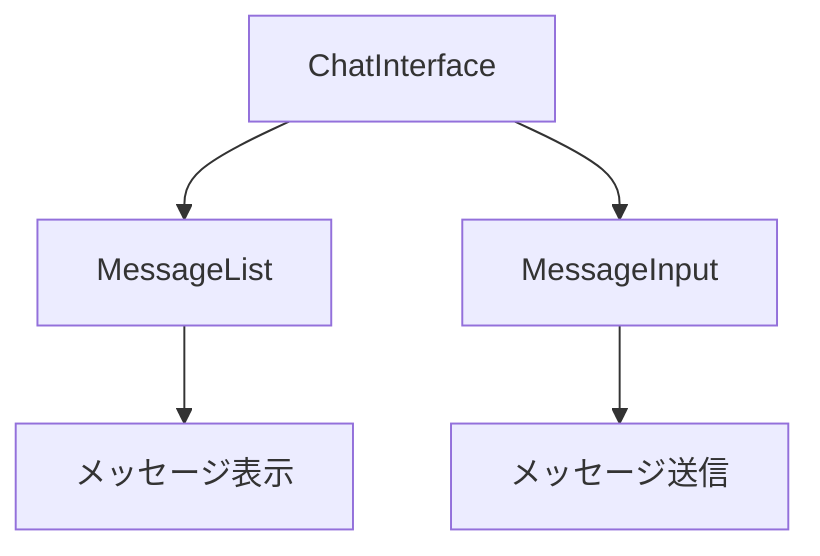

# コンポーネント

## 概要
このディレクトリには、アプリケーションのUIを構成する再利用可能なReactコンポーネントが含まれています。コンポーネントは機能ごとにサブディレクトリに分類されており、アプリケーション全体で一貫したデザインと動作を提供します。

## ディレクトリ構造
```
components/
├── chat/                # チャット関連のコンポーネント
│   ├── ChatInterface.tsx   # チャットインターフェース全体
│   ├── MessageInput.tsx    # メッセージ入力フォーム
│   └── MessageList.tsx     # メッセージ一覧
├── layout/              # レイアウト関連のコンポーネント
│   ├── Header.tsx          # アプリケーションヘッダー
│   ├── LeftPanel.tsx       # 左側パネル（会話一覧）
│   └── RightPanel.tsx      # 右側パネル（コンテキスト情報）
├── mindmap/             # マインドマップ関連のコンポーネント
│   └── MindMap.tsx         # マインドマップ表示
└── ui/                  # 基本的なUIコンポーネント
    ├── button.tsx          # ボタンコンポーネント
    ├── dialog.tsx          # ダイアログコンポーネント
    └── ...                 # その他のUIコンポーネント
```

## 主要サブディレクトリ

### chat
チャットインターフェースを構成するコンポーネントが含まれています。ユーザーとAIの対話を表示・管理するためのコンポーネントです。



### layout
アプリケーションの全体的なレイアウトを構成するコンポーネントが含まれています。ヘッダー、サイドパネルなどのコンポーネントです。

### mindmap
会話から抽出されたキーポイントを視覚的に表示するマインドマップコンポーネントが含まれています。SVGを使用して動的にマインドマップを生成します。

### ui
ボタン、ダイアログ、フォーム要素など、アプリケーション全体で使用される基本的なUIコンポーネントが含まれています。これらのコンポーネントはShadcn UIライブラリをベースにしています。

## 使用方法
コンポーネントは以下のように他のコンポーネントやページからインポートして使用します：

```tsx
import { Button } from "@/components/ui/button";
import ChatInterface from "@/components/chat/ChatInterface";

function MyComponent() {
  return (
    <div>
      <Button>クリック</Button>
    <ChatInterface conversationId="123" onOpenContext={() => {}} onExport={() => {}} />
    </div>
  );
}
```

## コンポーネント設計原則
- 各コンポーネントは単一の責任を持つように設計されています
- コンポーネントは必要に応じて再利用可能であるべきです
- 状態管理はできるだけ上位コンポーネントで行い、下位コンポーネントにはpropsとして渡します
- UIコンポーネントはビジネスロジックを含まず、表示と基本的な対話のみを担当します 