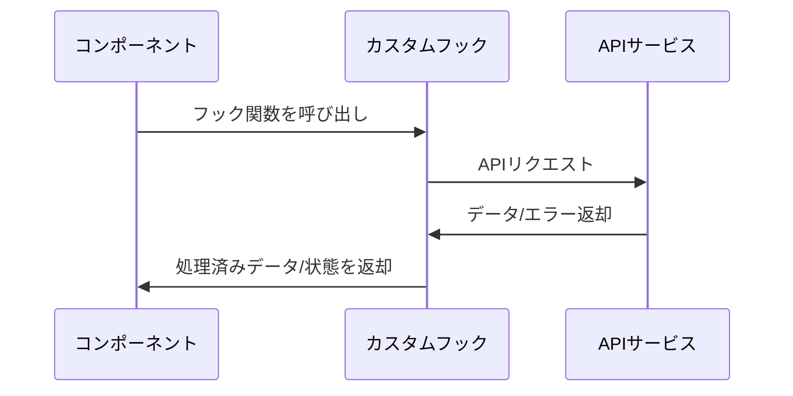

# フック (Hooks)

## 概要
このディレクトリには、アプリケーション全体で再利用可能なReactカスタムフックが含まれています。フックは、コンポーネントから共通のロジックを抽出し、再利用可能な形で提供するための仕組みです。

## 主要なフック

### use-conversation
会話データの取得、送信、更新などの機能を提供するフックです。

- `useConversations()`: すべての会話リストを取得します
- `useConversation(id)`: 特定のIDの会話を取得します
- `useSendMessage()`: 新しいメッセージを送信します
- `useUpdateContext()`: 会話のコンテキスト情報を更新します

### use-toast
通知メッセージ（トースト）を表示するためのフックです。エラーメッセージや成功メッセージなどの通知に使用されます。

### use-mobile
デバイスがモバイルかどうかを検出するためのフックです。レスポンシブデザインの実装に役立ちます。

## データフロー



## 使用方法
フックは以下のようにコンポーネント内でインポートして使用します：

```tsx
import { useConversation, useSendMessage } from "@/hooks/use-conversation";
import { useToast } from "@/hooks/use-toast";

function MyComponent({ conversationId }) {
  // 会話データを取得
  const { data: conversation, isLoading } = useConversation(conversationId);
  
  // メッセージ送信機能を取得
  const { mutate: sendMessage } = useSendMessage();
  
  // トースト通知機能を取得
  const { toast } = useToast();
  
  // メッセージ送信処理
  const handleSend = (content) => {
    sendMessage(
      { conversationId, content },
      {
        onSuccess: () => {
          toast({
            title: "送信成功",
            description: "メッセージが送信されました",
          });
        },
        onError: (error) => {
          toast({
            title: "エラー",
            description: error.message,
            variant: "destructive",
          });
        },
      }
    );
  };
  
  // コンポーネントのレンダリング
  // ...
}
```

## フック設計原則
- 各フックは単一の責任を持つように設計されています
- 状態管理とロジックをコンポーネントから分離し、再利用性を高めます
- APIリクエストはReact Queryを使用して効率的にキャッシュします
- エラー処理とローディング状態の管理を一貫して行います 