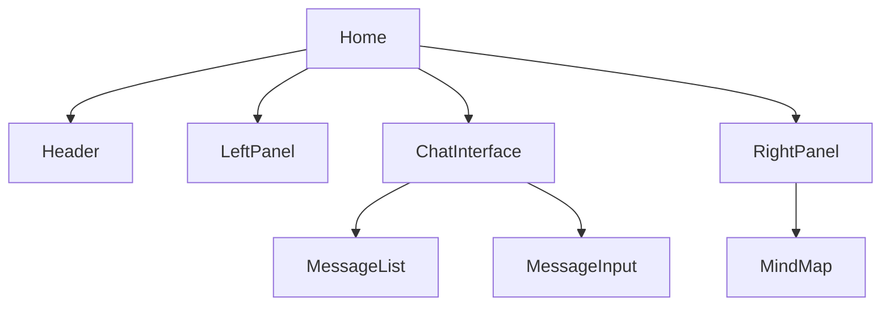

# ページ

## 概要
このディレクトリには、アプリケーションの各ページを構成するコンポーネントが含まれています。各ページコンポーネントは、ルーターによって特定のURLパスにマッピングされ、そのパスにアクセスしたときに表示されます。

## 主要なページ

### home.tsx
アプリケーションのメインページです。チャットインターフェース、会話一覧、コンテキスト情報などを表示します。

**主な機能：**
- 会話一覧の表示と選択
- チャットインターフェースの表示
- コンテキスト情報とマインドマップの表示
- 新しい会話の作成

**コンポーネント構成：**


### not-found.tsx
404エラーページです。存在しないURLにアクセスした場合に表示されます。

## ルーティング
アプリケーションは[Wouter](https://github.com/molefrog/wouter)というシンプルなルーティングライブラリを使用しています。ルーティング設定は`App.tsx`内の`Router`コンポーネントで定義されています：

```tsx
function Router() {
  return (
    <Switch>
      <Route path="/" component={Home} />
      <Route component={NotFound} />
    </Switch>
  );
}
```

## ページの状態管理
各ページコンポーネントは、必要に応じて以下の方法で状態を管理しています：

1. **ローカル状態**: `useState`フックを使用して、ページ内でのみ使用される状態を管理
2. **URLパラメータ**: クエリパラメータを使用して、選択された会話IDなどの状態を管理
3. **サーバーデータ**: React Queryを使用して、サーバーから取得したデータを管理

## 使用方法
新しいページを追加する場合は、以下の手順に従います：

1. このディレクトリに新しいページコンポーネントファイルを作成
2. `App.tsx`の`Router`コンポーネントに新しいルートを追加

```tsx
// 新しいページコンポーネント
function NewPage() {
  return <div>新しいページの内容</div>;
}

// Routerコンポーネントに追加
function Router() {
  return (
    <Switch>
      <Route path="/" component={Home} />
      <Route path="/new-page" component={NewPage} />
      <Route component={NotFound} />
    </Switch>
  );
}
``` 