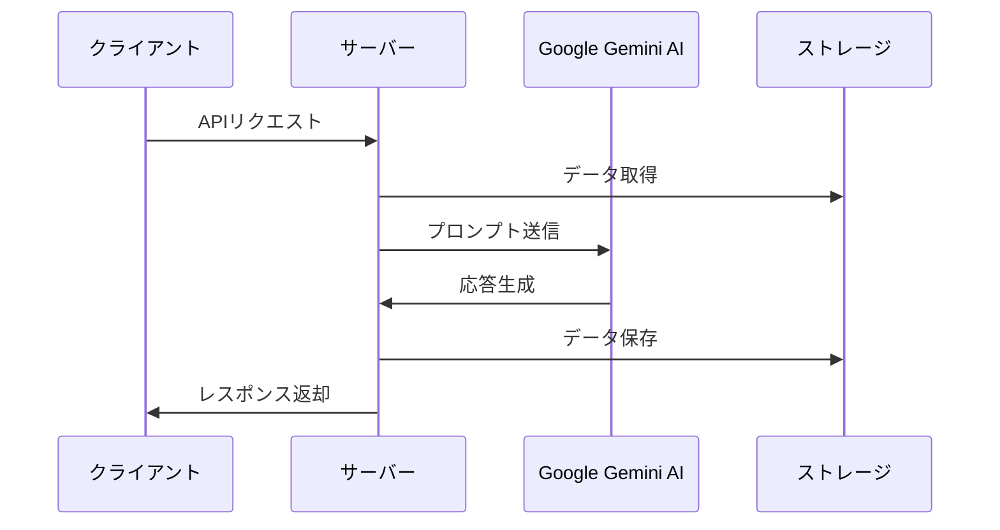

# サーバー（バックエンド）

## 概要
このディレクトリには、ConstructiveTalkアプリケーションのバックエンド（サーバー側）部分が含まれています。Express.jsフレームワークを使用してAPIエンドポイントを提供し、Google Gemini AIとの連携、データの永続化、LINEボットとの統合などの機能を実装しています。

## ディレクトリ構造
```
server/
├── ai/                  # AI関連の処理
│   └── gemini.ts        # Google Gemini AIとの連携
├── line/                # LINE連携機能
│   ├── client.ts        # LINEクライアント設定
│   └── handlers.ts      # LINEウェブフックハンドラー
├── index.ts             # サーバーのエントリーポイント
├── routes.ts            # APIルート定義
├── storage.ts           # データ保存関連の処理
├── prd-content.ts       # システムプロンプト生成
└── vite.ts              # 開発環境設定
```

## 主要コンポーネント

### APIエンドポイント
`routes.ts`ファイルには、以下の主要なAPIエンドポイントが定義されています：

- `GET /api/conversations`: すべての会話リストを取得
- `GET /api/conversations/:id`: 特定のIDの会話を取得
- `POST /api/conversations`: 新しい会話を作成
- `POST /api/conversations/:id/messages`: 会話にメッセージを追加
- `PATCH /api/conversations/:id/context`: 会話のコンテキスト情報を更新
- `GET /api/conversations/:id/export`: 会話をMarkdown形式でエクスポート
- `POST /api/webhook`: LINEボットのウェブフックエンドポイント

### AI処理
`ai/gemini.ts`ファイルには、Google Gemini AIとの連携機能が実装されています。主な機能は以下の通りです：

- AIモデルの初期化と設定
- 会話履歴とコンテキスト情報を含むプロンプトの生成
- AIからの応答の処理とメタデータ（タイトル、キーポイント、要約、タグ）の抽出

### データストレージ
`storage.ts`ファイルには、会話データの保存と取得を行う機能が実装されています。現在はインメモリストレージを使用していますが、将来的にはデータベースに置き換えることも可能です。

### LINE連携
`line/`ディレクトリには、LINEボットとの連携機能が実装されています。LINEからのメッセージを受け取り、AIで処理して返信する機能を提供します。

## データフロー



## 使用方法
サーバーを起動するには、プロジェクトルートで以下のコマンドを実行します：

```bash
# 開発モード
pnpm dev

# 本番モード
pnpm build
pnpm start
```

## 環境変数
サーバーは以下の環境変数を使用します：

- `GOOGLE_API_KEY`: Google Gemini AIのAPIキー
- `LINE_CHANNEL_ACCESS_TOKEN`: LINE Messaging APIのアクセストークン
- `LINE_CHANNEL_SECRET`: LINE Messaging APIのチャンネルシークレット
- `NODE_ENV`: 実行環境（development/production） 