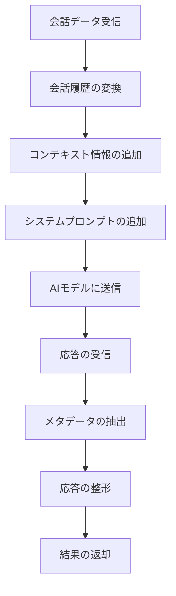

# AI処理

## 概要
このディレクトリには、Google Gemini AIとの連携機能が実装されています。ユーザーとの会話を処理し、AIからの応答を生成するための機能を提供します。また、会話からキーポイント、要約、タグなどのメタデータを抽出する機能も含まれています。

## ファイル構造
```
ai/
└── gemini.ts       # Google Gemini AIとの連携機能
```

## 主要機能

### Google Gemini AIの初期化
`gemini.ts`ファイルでは、Google Generative AIクライアントを初期化し、APIキーを設定しています。

```typescript
const apiKey = process.env.GOOGLE_API_KEY || '';
let genAI: GoogleGenerativeAI | null = null;

try {
  genAI = new GoogleGenerativeAI(apiKey);
} catch (error) {
  console.error("Error initializing Google Generative AI:", error);
}
```

### メッセージ処理
`processMessageWithAI`関数は、ユーザーとの会話をAIに送信し、応答を生成します。この関数は以下の処理を行います：

1. 会話履歴をAIが理解できる形式に変換
2. コンテキスト情報（時間、場所、気分、アルコールレベル）を含むプロンプトを生成
3. AIモデルにプロンプトを送信し、応答を取得
4. 応答からメタデータ（タイトル、キーポイント、要約、タグ）を抽出

### メタデータ抽出
AIからの応答には、通常の会話文に加えて、JSONブロックとしてメタデータが含まれています。このメタデータを抽出し、会話データに追加します。

```typescript
try {
  const jsonMatch = responseText.match(/```json\n([\s\S]*?)\n```/);
  if (jsonMatch && jsonMatch[1]) {
    const metadata = JSON.parse(jsonMatch[1]);
    
    // メタデータを処理
    if (metadata.title) {
      title = metadata.title;
    }
    
    if (metadata.keyPoints && Array.isArray(metadata.keyPoints)) {
      keyPoints = metadata.keyPoints;
    }
    
    // ...
  }
} catch (error) {
  console.error("Error parsing JSON metadata:", error);
}
```

## 処理フロー



## 使用方法
`gemini.ts`の`processMessageWithAI`関数は、以下のように使用します：

```typescript
import { processMessageWithAI } from "./ai/gemini";
import { createSystemPrompt } from "./prd-content";

// 会話データ
const conversation = {
  id: "123",
  title: "新しい会話",
  messages: [...],
  context: {
    time: "2023-03-09T12:00:00Z",
    place: "自宅",
    mood: "リラックス",
    alcoholLevel: "なし"
  },
  // ...
};

// システムプロンプトを生成
const systemPrompt = await createSystemPrompt();

// AIで処理
const aiResponse = await processMessageWithAI(conversation, systemPrompt);

console.log(aiResponse.message);        // AIからの応答メッセージ
console.log(aiResponse.keyPoints);      // 抽出されたキーポイント
console.log(aiResponse.summary);        // 会話の要約
console.log(aiResponse.tags);           // 関連するタグ
```

## エラー処理
AIとの通信に失敗した場合は、エラーメッセージを含む応答を返します。また、JSONメタデータの解析に失敗した場合は、エラーをログに出力し、通常の応答のみを返します。 