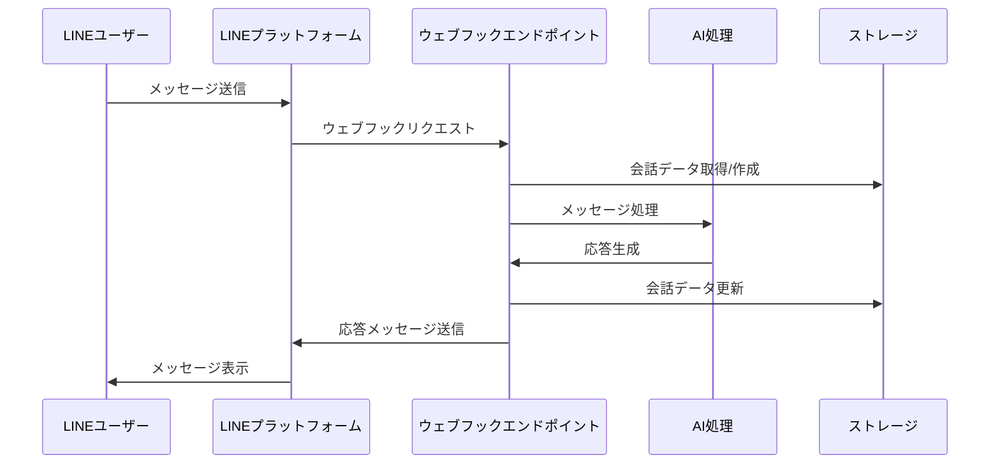

# LINE連携

## 概要
このディレクトリには、LINEボットとの連携機能が実装されています。LINEメッセージングAPIを使用して、ユーザーからのメッセージを受け取り、AIで処理して返信する機能を提供します。これにより、ユーザーはLINEアプリを通じてConstructiveTalkのAI機能を利用することができます。

## ファイル構造
```
line/
├── client.ts       # LINEクライアント設定
└── handlers.ts     # LINEウェブフックハンドラー
```

## 主要機能

### LINEクライアント設定
`client.ts`ファイルでは、LINE Messaging APIクライアントを初期化し、アクセストークンとチャンネルシークレットを設定しています。

```typescript
import { Client } from "@line/bot-sdk";

// LINE APIの設定
const config = {
  channelAccessToken: process.env.LINE_CHANNEL_ACCESS_TOKEN || "",
  channelSecret: process.env.LINE_CHANNEL_SECRET || "",
};

// LINEクライアントの作成
export const lineClient = new Client(config);
```

### ウェブフックハンドラー
`handlers.ts`ファイルには、LINEからのウェブフックリクエストを処理するハンドラー関数が実装されています。主な処理は以下の通りです：

1. ウェブフックリクエストの検証
2. イベントタイプの判別（メッセージ、フォロー、ブロックなど）
3. メッセージイベントの場合、メッセージ内容の取得
4. AIを使用してメッセージを処理
5. 応答メッセージの生成と送信

## 処理フロー



## 会話管理
LINEユーザーとの会話は、ユーザーIDをキーとして保存されます。ユーザーが初めてメッセージを送信すると、新しい会話が作成されます。その後のメッセージは同じ会話に追加されます。

## 使用方法
LINE連携機能を使用するには、以下の手順に従います：

1. LINE Developersコンソールでボットを作成し、チャンネルアクセストークンとチャンネルシークレットを取得
2. 環境変数に以下の値を設定：
   ```
   LINE_CHANNEL_ACCESS_TOKEN=your_access_token
   LINE_CHANNEL_SECRET=your_channel_secret
   ```
3. サーバーを起動し、ウェブフックURLを設定（例：`https://your-server.com/api/webhook`）
4. LINEアプリでボットを友達追加し、メッセージを送信

## エラー処理
ウェブフックリクエストの処理中にエラーが発生した場合は、エラーをログに出力し、適切なHTTPステータスコードを返します。また、LINEプラットフォームへのメッセージ送信に失敗した場合も、エラーをログに出力します。 